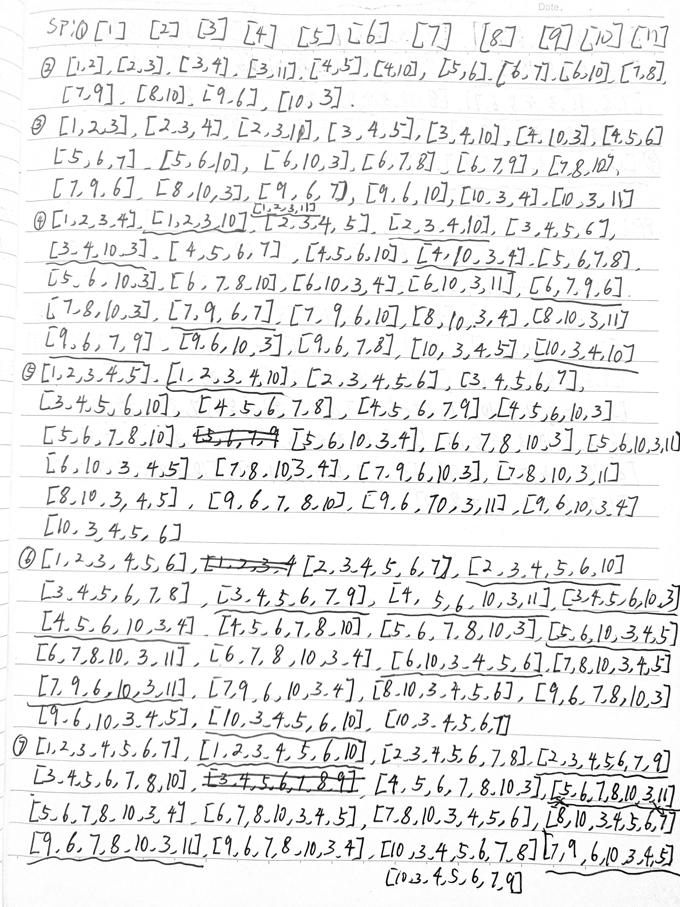

1.  画出控制流图：

| 节点/边 | 含义                                                                                                                 |
|---------|----------------------------------------------------------------------------------------------------------------------|
| 1       | args: subject, pattern                                                                                               |
| 2       | NOTFOUND = -1 iSub = 0, rtnIndex = NOTFOUND isPat = false sujectLen = subject.length() patternLen = pattern.length() |
| 3       | Dummy node                                                                                                           |
| 4       | Dummy node                                                                                                           |
| 5       | rtnIndex = iSub iPat = true                                                                                          |
| 6       | Dummy node                                                                                                           |
| 7       | Dummy node                                                                                                           |
| 8       | rtnIndex = NOTFOUND iPat = false break                                                                               |
| 9       | iPat++                                                                                                               |
| 10      | iSub++                                                                                                               |
| 11      | return(rtnIndex)                                                                                                     |
| (3, 4)  | isPat == false && iSub + patternLen – 1 \< subjectLen                                                                |
| (3, 11) | isPat != false \|\| isSub + patternLen – 1 \>= subjectLen                                                            |
| (4, 5)  | subject.charAt(iSub) == pattern.charAt(0)                                                                            |
| (4, 10) | sub ject.charAt(iSub) != pattern.charAt(0)                                                                           |
| (6, 7)  | iPat \< patternLen                                                                                                   |
| (6, 10) | iPat \>= patternLen                                                                                                  |
| (7, 8)  | subject.charAt(iSub + iPat) != pattern.charAt(iPad)                                                                  |
| (7, 9)  | subject.charAt(iSub + iPat) == pattern.charAt(iPad)                                                                  |

2.  

    找出图中的主路径：

加一条

[4, 5, 6, 7, 8, 10, 3, 11]，去掉[1, 2, 3, 10], [2, 3, 4, 10], [1, 2, 3, 4, 5, 6,
10]

故主路径有32条。

1.  找到测试用例，可以覆盖所有的主路径：

>   找出可以覆盖所有主路径的测试路径：

-   [1, 2, 3, 11]

-   [1, 2, 3, 4, 5, 6, 7, 8, 10, 3, 4 ,5, 6, 7, 8, 10, 3, 11]

-   [1, 2, 3, 4, 10, 3, 4, 10, 3, 4, 5, 6, 7, 9, 6, 7, 8, 10, 3, 4, 5, 6, 7, 8,
    10, 3, 11]

-   [1, 2, 3, 4, 5, 6, 7, 9, 6, 7, 8, 10, 3, 4, 5, 6, 7, 9, 6, 10, 3, 11]

-   [1, 2, 3, 4, 10, 3, 4, 5, 6, 10, 3, 4, 5, 7, 9, 6, 10, 3, 4, 5, 6, 10, 3,
    11]

-   [1, 2, 3, 4, 5, 6, 10, 3, 4, 5, 6, 7, 9, 6, 10, 3, 4, 5, 6, 7, 9, 6, 7, 8,
    10, 3, 11]

1.  对于测试路径[1, 2, 3, 11]：

测试用例：

test: subject = “apple” pattern = “banana”

expected: -1

1.  对于测试路径[1, 2, 3, 4, 5, 6, 7, 8, 10, 3, 4 ,5, 6, 7, 8, 10, 3, 11]：

测试用例：

test: subject = “apple” pattern = “aaple”

expected: -1

1.  对于测试路径[1, 2, 3, 4, 10, 3, 4, 10, 3, 4, 5, 6, 7, 9, 6, 7, 8, 10, 3, 4,
    5, 6, 7, 8, 10, 3, 11]：

测试用例：

test: subject = “xyapple” pattern = “aplle”

expected: -1

1.  对于测试路径[1, 2, 3, 4, 10, 3, 4, 10, 3, 4, 5, 6, 7, 9, 6, 7, 8, 10, 3, 4,
    5, 6, 7, 8, 10, 3, 11]：

测试用例：

test: subject = “xyabcde” pattern = “abcde”

expected: 2

1.  对于测试路径[1, 2, 3, 4, 10, 3, 4, 5, 6, 10, 3, 4, 5, 7, 9, 6, 10, 3, 4, 5,
    6, 10, 3, 11]：

测试用例：

test: subject = “xabcab” pattern = “abd”

expected: -1

1.  对于测试路径[1, 2, 3, 4, 5, 6, 10, 3, 4, 5, 6, 7, 9, 6, 10, 3, 4, 5, 6, 7,
    9, 6, 7, 8, 10, 3, 11]：

测试用例：

test: subject = “abcabad” pattern = “ab”

expected: -1
